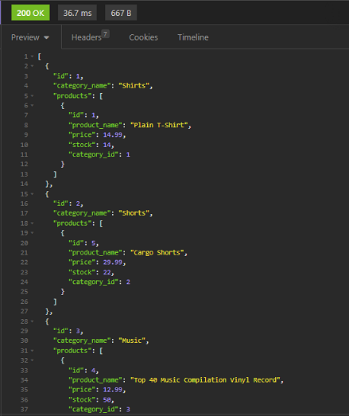
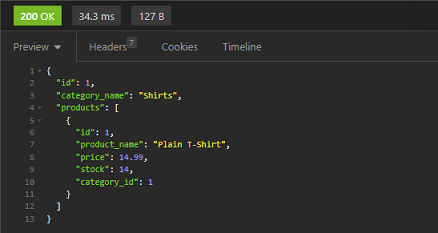
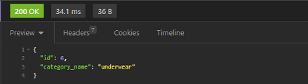
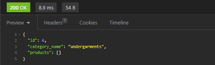
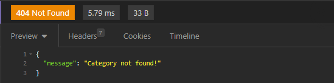

# **E Commerce Back End**

## This application demonstrates the *back end* process of a fetch api call using a server file.  Once a created path is called, it'll return the functionality of set values for that specific api call.  Here the application is presented as a *Commercial example* of a back end database for sales products.&nbsp;&nbsp;*Ie:&nbsp;&nbsp;Product names, prices, product tag descriptions, mutiple tagging for multiple descriptions, and more.*<br><br>

### **Table of contents:**

- [Getting Started](#getting)
- [Installations](#installations)
- [Setup](#setup)
- [Usage](#usage)
- [Resources](#resources)
- [Location](#location)
- [License](#license)

## Getting Started:

<br>First to get started, you will need to have downloaded Node.js.&nbsp;&nbsp;If you haven't, you may go here.&nbsp;&nbsp;[*Node.js downloads*](https://nodejs.org/en/download/)<br><br><br>Second, you will need to have downloaded mysql.&nbsp;&nbsp;If you haven't, you may go here.&nbsp;&nbsp;[*mysql downloads*](https://www.mysql.com/downloads/)<br><br><br>Third, you will need to have downloaded Insomnia.&nbsp;&nbsp;If you haven't, you may go here.&nbsp;&nbsp;[*Insomnia downloads*](https://insomnia.rest/products/insomnia)

## Installations:

&nbsp;&nbsp;&nbsp;&nbsp;&nbsp;&nbsp;&nbsp;&nbsp;
  
First, you'll need to navigate to the correct directory and open it in an 'Integrated Terminal'.<br>* After navigating to the correct directory, this can be done simply by 'right clicking' the server.js file, and selecting 'Open in Integrated Terminal'.<br><br>Next you'll want to type in the command line *Example 1* below.<br>* This will update the package.json file to your local directory path.

*Example 1:*
```shell
npm init -y
```

Next, you will want to type in the command line *Example 2* below.<br>* This will install the neccessary dependancies needed that are defined in the package.json file.

*Example 2:*
```shell
npm install
```

Now you should see a folder *node_modules* and a file *package-lock.json*.<br>* This folder contains the *packets* needed for the application to run and the lock file is the *path directory* for that folder.

### [**Back to top**](#)

## Setup:
### **Creating the Database:**

First, assuming your 'Integrated Terminal' is still open, type *Example 1* below.<br>Then enter your password.<br>* If you closed the terminal, simply *right click* on the server.js file, select 'Open in Integrated Terminal'.

*Example 1:*
```shell
mysql -u root -p
```

Second, type *Example 2* below.<br>* This will create a localized sql file (database) to your system.

*Example 2:*
```shell
Source db/schema.sql;
```

Third, type *Example 3* below.<br> * This will log out of your mysql terminal instance.

*Example 3:*
```shell
exit
```

### **Seeding the Database**

While still being in the main directory, with 'Integrated Terminal' still opened, type the *Example* below.<br>* This will activate the files with preset data information to their specific models which will create tables specific to each model.

*Example:*
```shell
npm run seed
```

The database system is complete with tables that include information from the seeding process.<br>We can now start the routed api fetch response processes.

### [**Back to top**](#)

## Usage:
  
With the 'Integrated Terminal' still open after seeding, on the command line type the *CL Example* below.<br>* If you closed the terminal, simply *right click* on the server.js file, select 'Open in Integrated Terminal'.

*CL Example:*
```shell
npm start
```

The last statement presented in the console should read, "Now listening".<br>*&nbsp;*You must leave the 'Integrated Terminal' opened.  This is your live connection to your localhost.*<br><br>

### **Now open your Insomnia program.**

At the address bar, select GET, and enter *INS Example 1* below.<br>* This will fetch all categories in the database system.<br>

*INS Example 1:*
```
http://localhost:3001/api/categories
```
*INS Output 1:*<br>


At the address bar, select 'GET', and enter *INS Example 2* below.<br>Then press 'Send'.<br>* This will fetch category id equal to 1.<br>* If id # entered does not exist, feedback shown '"message": "Category not found!".

*INS Example 2:*
```
http://localhost:3001/api/categories/1
```
*INS Output 2:*<br>


At the address bar, select 'POST', and enter *INS Example 3* below.<br>In the field box 'JSON', on line 1, enter the object below *INS Example 3*, labeled *INS Object 3*.<br>Then press 'Send'.<br>* This will create a category with the name *underwear*.

*INS Example 3:*
```
http://localhost:3001/api/categories/
```

*INS Object 3:*
```javascript
{
    "category_name": "underwear"
}
```

*INS Output 3:*<br>


At the address bar, select 'PUT', and enter *INS Example 4* below.<br>In the field box 'JSON', remove previous object, and replace with the object below *INS Example 4*, labeled *INS Object 4*.<br>Then press 'Send'.<br>* This will update the created category *underwear* with the name *undergarments*.

*INS Example 4:*
```
http://localhost:3001/api/categories/6
```

*INS Object 4:*
```javascript
{
    "category_name": "undergarments"
}
```

*INS Output 4:*<br>


At the address bar, select 'DELETE', and enter *INS Example 5* below.<br>Then press 'Send'.<br>* This will delete the created/updated now named category *undergarments*.

*INS Example 5:*
```
http://localhost:3001/api/categories/6
```

*INS Output 5:*<br>


*&nbsp;*Usage 'Output' examples shown here only reflects categories.*<br><br>To *change* call type simply replace the word 'categories', in the Insomnia address bar, with 'products' or 'tags'.<br>*&nbsp;*Still yet, object keys and appearances vary.*<br>For references, view the *walkthrough video* below.

**Walkthrough video [*click here*.](https://drive.google.com/file/d/1MgjOiwTnzAuIYv1BSkaSaoRjxsPr5iXj/view)**

### [**Back to top**](#)

## Resources:

[node.js](https://nodejs.org/en/docs/)<br>[express](https://expressjs.com/)<br>[sequelize](https://sequelize.org/)<br>[mysql](https://www.npmjs.com/package/mysql)<br>[dotenv](https://www.npmjs.com/package/dotenv)<br>[Google](https://www.google.com)<br>**_Original Source Code:_**&nbsp;&nbsp;[provided by UTexas.edu](https://techbootcamps.utexas.edu/coding/)

## Location:

[E Commerce Back End](https://github.com/zMag33z/week-13_E-commerce_Back_End)

## License:
  

  
See *Terms & Conditions* of the license [***here***](https://opensource.org/licenses/MIT).

<br>


### [**Back to top**](#)